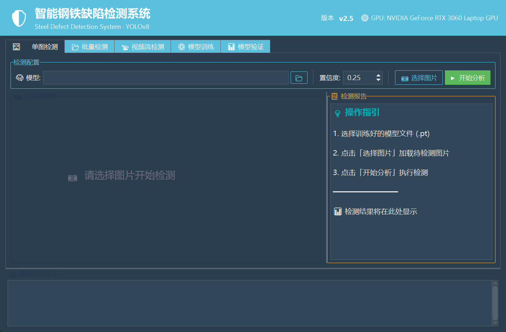
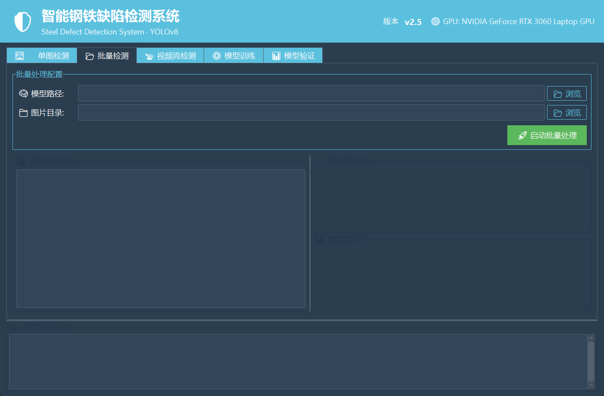
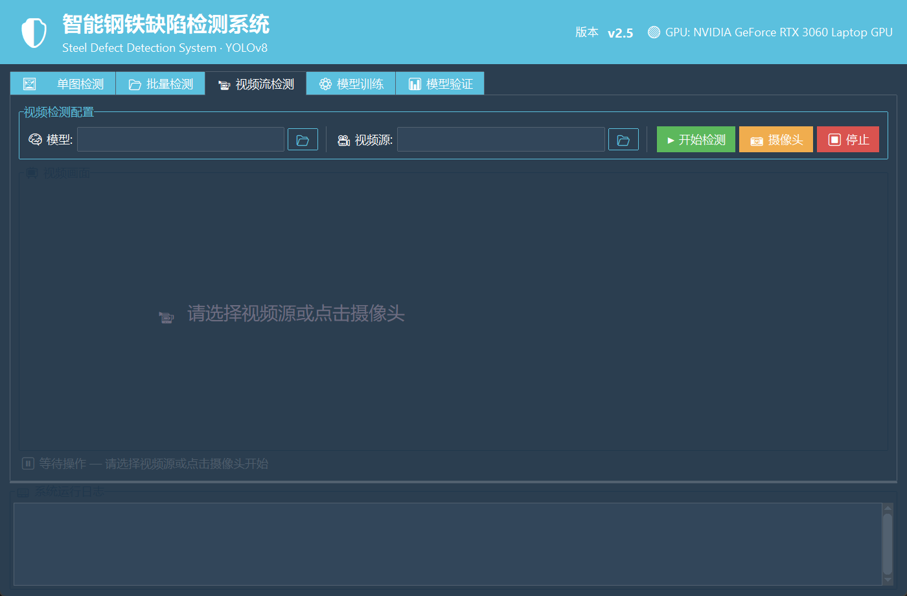
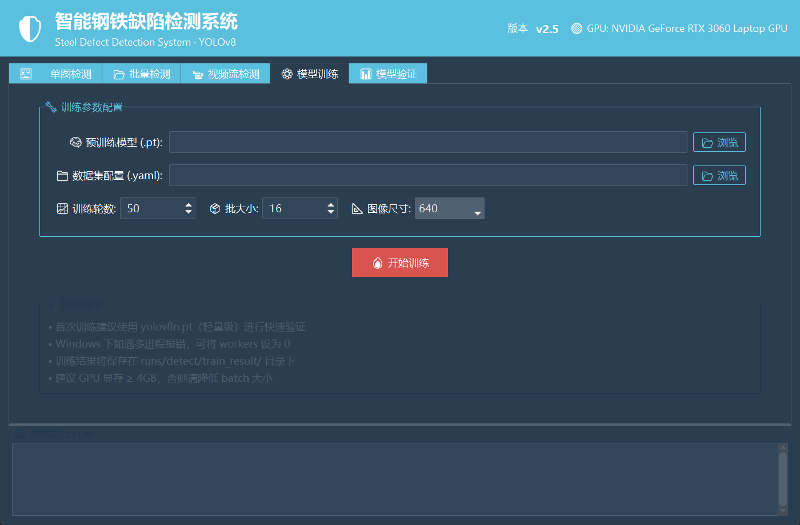
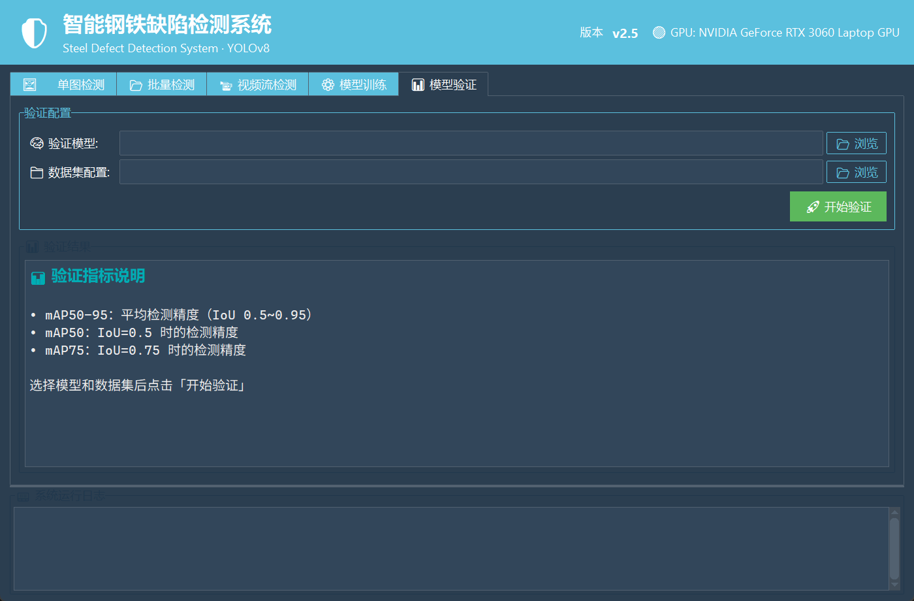

# Steel Surface Defect Detection with YOLOv8

An open source YOLOv8 project for steel surface defect detection, training, validation, inference, and GUI demos.

[English](README.md) | [简体中文](README.zh-CN.md)


---

## Overview

This repository is a learning-oriented steel surface defect detection project built on **YOLOv8**. It targets NEU-DET style steel defect datasets and provides a practical workflow for model training, validation, image inference, video inference, and a desktop GUI demo.

It is designed for students, computer vision beginners, and industrial vision learners who want a real, runnable, and maintainable open source project rather than an unmaintained collection of scripts.

> Datasets, training outputs, and model weights are not included in this repository. Prepare them locally by following [docs/dataset.md](docs/dataset.md).

## Features

| Feature | Description |
| --- | --- |
| Single-image inference | Load one image and visualize detected defect boxes. |
| Batch inference | Process an image folder and generate summary reports. |
| Video inference | Run defect detection on video files or camera streams. |
| Model training | Train YOLOv8 models from the command line or GUI. |
| Model validation | Evaluate trained weights and inspect mAP metrics. |
| GUI demo | Use a `ttkbootstrap` desktop interface for common workflows. |

## Documentation

- [macOS and Apple Silicon guide](docs/macos.md)
- [Dataset preparation](docs/dataset.md)
- [Troubleshooting](docs/troubleshooting.md)
- [Roadmap](ROADMAP.md)
- [Support](SUPPORT.md)
- [Security policy](SECURITY.md)

## Screenshots

### Single-image inference



### Batch inference



### Video inference



### Training



### Validation



## Project Structure

```text
steel-defect-detection/
├── ui.py                  # Desktop GUI built with ttkbootstrap
├── train.py               # YOLOv8 training entrypoint
├── predict.py             # Image and batch prediction entrypoint
├── val.py                 # Validation entrypoint
├── video_predict.py       # Video inference helper
├── translate.py           # VOC XML to YOLO TXT conversion utility
├── dataset.yaml           # Dataset configuration
├── requirements.txt       # Python dependencies
├── docs/                  # Project setup and maintenance docs
├── .github/               # CI, Dependabot, and issue templates
├── datasets/              # Local datasets, ignored by git
├── runs/                  # Local training/inference outputs, ignored by git
└── weights/ or *.pt        # Local model weights, ignored by git
```

## Defect Classes

The default configuration follows the six common NEU-DET steel surface defect classes:

| ID | Class | Meaning |
| --- | --- | --- |
| 0 | `crazing` | Fine crack-like surface patterns |
| 1 | `inclusion` | Non-metallic inclusion defects |
| 2 | `patches` | Irregular surface patches |
| 3 | `pitted_surface` | Pitting or corrosion-like marks |
| 4 | `rolled-in_scale` | Oxide scale rolled into the surface |
| 5 | `scratches` | Linear scratch defects |

## Quick Start

### 1. Requirements

- Python 3.10 recommended
- CPU, Apple Silicon MPS, or NVIDIA CUDA
- Windows, Linux, or macOS

macOS users should start with [docs/macos.md](docs/macos.md).

### 2. Install

```bash
git clone https://github.com/YfengJ/steel-defect-detection.git
cd steel-defect-detection

python -m venv venv

# Windows
venv\Scripts\activate

# Linux/macOS
source venv/bin/activate

python -m pip install --upgrade pip
python -m pip install -r requirements.txt
```

Prepare these files locally:

- Dataset: see [docs/dataset.md](docs/dataset.md)
- Weights: download a YOLOv8 pretrained weight such as `yolov8n.pt`, or use your own trained `best.pt`

### 3. Launch the GUI

```bash
python ui.py
```

The GUI includes tabs for image prediction, batch prediction, video inference, training, and validation.

## Command-line Usage

### Train

```bash
# CPU
python train.py --model yolov8n.pt --data dataset.yaml --epochs 50 --batch 16 --device cpu

# Apple Silicon MPS
python train.py --model yolov8n.pt --data dataset.yaml --epochs 50 --batch 8 --device mps

# NVIDIA CUDA
python train.py --model yolov8n.pt --data dataset.yaml --epochs 50 --batch 16 --device cuda
```

### Validate

```bash
python val.py --model runs/detect/train_result/weights/best.pt --data dataset.yaml
```

### Predict

```bash
python predict.py --model runs/detect/train_result/weights/best.pt --source path/to/image.jpg
```

## Dataset Preparation

This project can use the [NEU Surface Defect Database](http://faculty.neu.edu.cn/songkechen/zh_CN/zdylm/263270/list/) or another dataset with the same class mapping.

Expected local layout:

```text
datasets/NEU-DET/
├── images/
│   ├── train/
│   ├── val/
│   └── test/
├── labels/
│   ├── train/
│   ├── val/
│   └── test/
└── annotations/
```

YOLO label files should use:

```text
class_id x_center y_center width height
```

All coordinates must be normalized to `0.0` to `1.0`.

If your annotations are VOC XML files, place them under `datasets/NEU-DET/annotations/` and run:

```bash
python translate.py
```

## Model Weights

Model weights are intentionally excluded from git. Keep large artifacts locally, in cloud storage, or in GitHub Releases.

Common local choices:

| Weight | Use case |
| --- | --- |
| `yolov8n.pt` | Fastest baseline for CPU or small experiments |
| `yolov8s.pt` | Better speed/accuracy balance |
| `yolov8m.pt` | Medium experiments when hardware allows |
| `best.pt` | Your trained defect detector |

## Dependency Updates

Dependabot is enabled for Python dependencies and GitHub Actions. Large dependency jumps are reviewed conservatively because PyTorch, OpenCV, NumPy, and Ultralytics compatibility can be sensitive across platforms.

## Release Notes

See [RELEASE_NOTES.md](RELEASE_NOTES.md) for v0.1.1 changes, known limitations, and next plans.

## License

This project is licensed under the [AGPL-3.0 License](LICENSE).

YOLOv8 is provided by [Ultralytics](https://github.com/ultralytics/ultralytics) and follows its upstream license terms.
